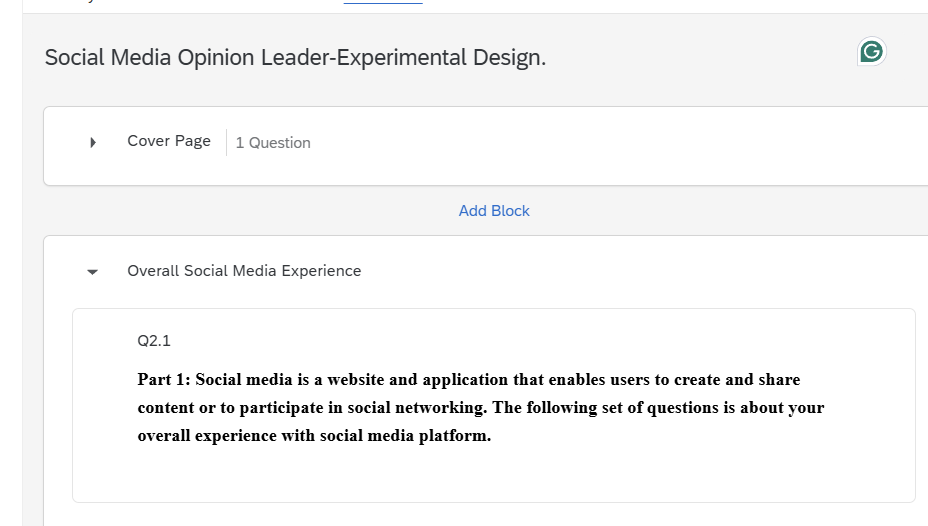
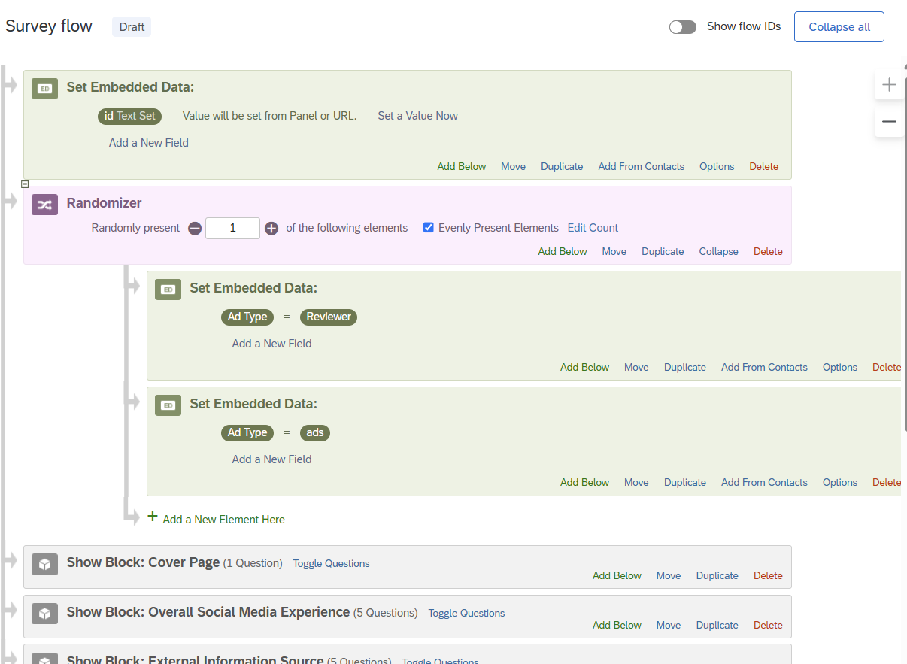
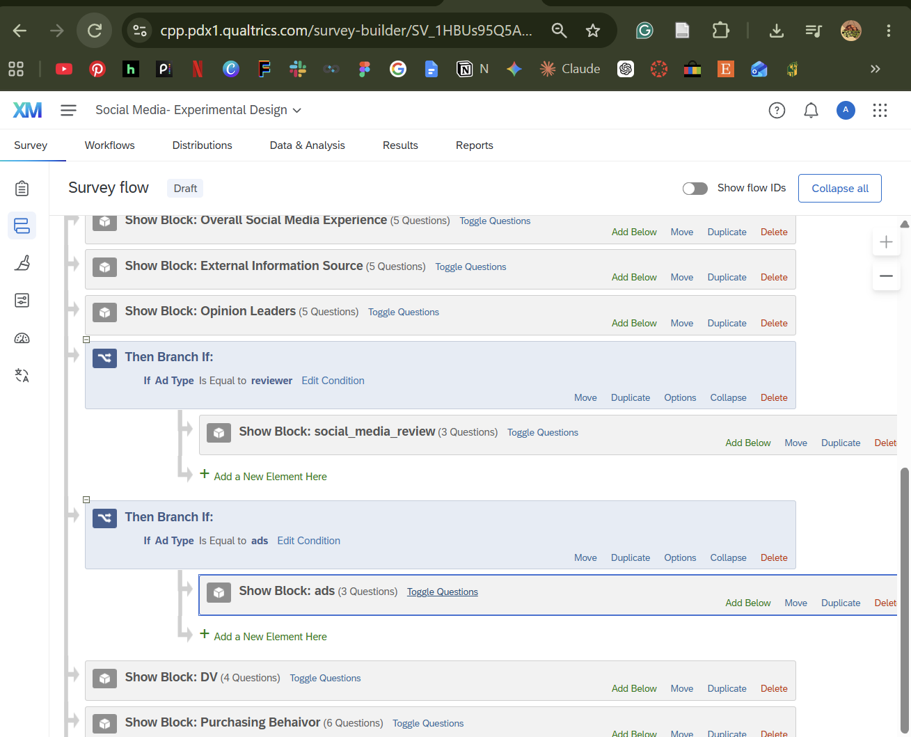
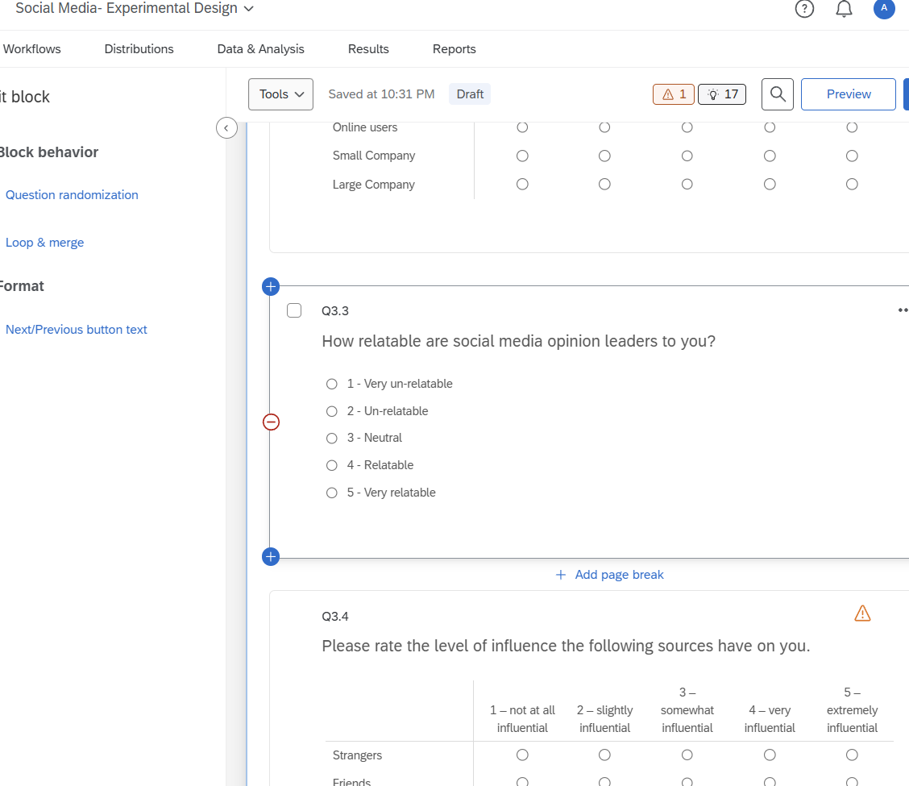
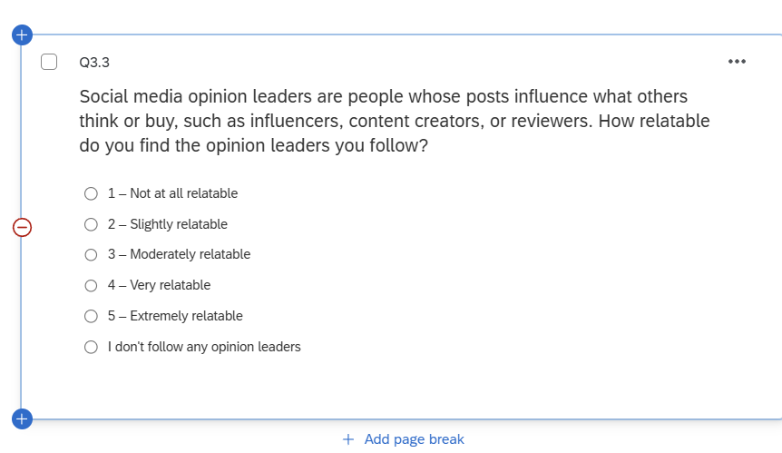
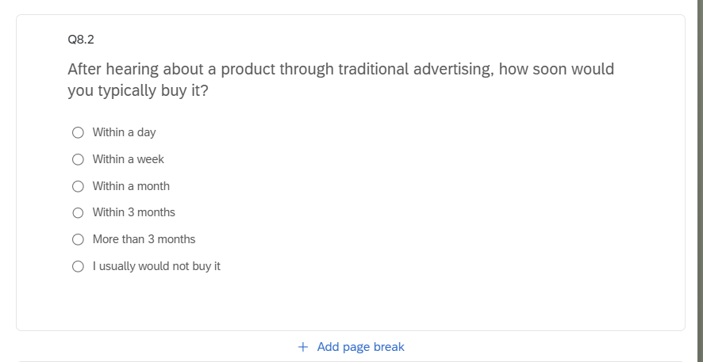
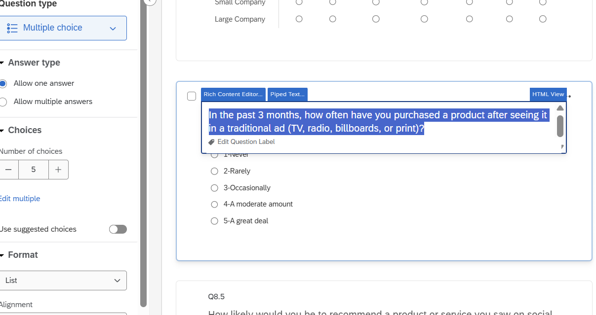
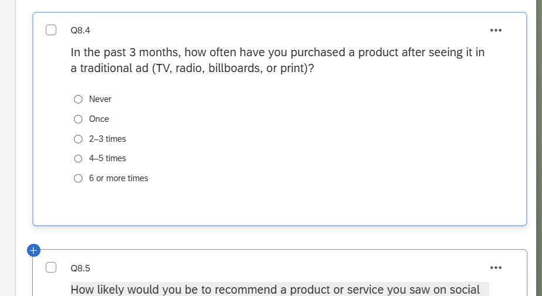

## 1. Project Title Change

I renamed the project from "Social Media- Experimental Design" to "Social Media Opinion Leader-Experimental Design" by clicking the project title and editing it.

{width="80%"}

## 2. Random Assignment (Between-Subjects Design)

To compare the two ad types, each participant should see only one ad, with about half seeing the social media review and half seeing the traditional ad. Random assignment makes the two groups equivalent on average (e.g., age, gender, attitude toward Nike), so any difference in the dependent variables can be attributed to the ad type.

**Randomizer.** In the Survey Flow, I added a Randomizer directly below the Set Embedded Data element that assigns each participant an `id`, which is the earliest point in the survey. The Randomizer presents 1 of 2 elements, and "Evenly Present Elements" is checked so the conditions are balanced. Each element sets an embedded data field called `Ad Type`, with a value of either `reviewer` or `ads`.

{width="80%"}

**Routing with branches.** After the Opinion Leaders block, I added two branches. The first shows the social_media_review block only if `Ad Type` is equal to `reviewer`. The second shows the ads block only if `Ad Type` is equal to `ads`. The DV block stays at the main level of the flow below both branches, so every participant answers the dependent variable questions regardless of which ad they saw. I tested the survey in preview mode several times to confirm that each run showed only one of the two ads and always showed the DV block.

{width="80%"}

## 3. Questionnaire Improvements

### Improvement 1: Q3.3 (Relatability of Opinion Leaders)

**Original:** "How relatable are social media opinion leaders to you?" (1 – Very un-relatable, 2 – Un-relatable, 3 – Neutral, 4 – Relatable, 5 – Very relatable)

**Problems:**

- "Social media opinion leaders" is not defined, so respondents may picture very different people, from celebrities to small creators.
- "Un-relatable" is not standard English, and the bipolar scale does not fit the concept. Relatability ranges from none to a lot, so a unipolar scale is more appropriate. The "Neutral" midpoint is also ambiguous.
- There is no option for respondents who do not follow any opinion leaders, which forces them to guess or choose "Neutral."

**Revised:** "Social media opinion leaders are people whose posts influence what others think or buy, such as influencers, content creators, or reviewers. How relatable do you find the opinion leaders you follow?" (1 – Not at all relatable, 2 – Slightly relatable, 3 – Moderately relatable, 4 – Very relatable, 5 – Extremely relatable, I don't follow any opinion leaders)

{width="80%"}

{width="80%"}

### Improvement 2: Q8.2 (Purchase Time Frame)

**Original:** "Please indicate the time frame of which you would make purchase after hearing about it through tr..."

**Problems:** The wording is grammatically incorrect ("of which you would make purchase"), and "it" never refers to anything, so respondents have to guess what product the question is about. There was also no option for respondents who would not buy the product at all.

**Revised:** "After hearing about a product through traditional advertising, how soon would you typically buy it?" (Within a day, Within a week, Within a month, Within 3 months, More than 3 months, I usually would not buy it)

{width="80%"}

### Improvement 3: Q8.4 (Purchases from Traditional Advertising)

**Original:** "How often do you purchase a product or service because of traditional advertising? (TV, radio, billboards...)"

**Problems:** The question has no time frame, so respondents may think about very different periods. It also asks people to judge why they bought something, which is hard to recall accurately.

**Revised:** "In the past 3 months, how often have you purchased a product after seeing it in a traditional ad (TV, radio, billboards, or print)?" (Never, Once, 2–3 times, 4–5 times, 6 or more times)

{width="80%"}

{width="80%"}
