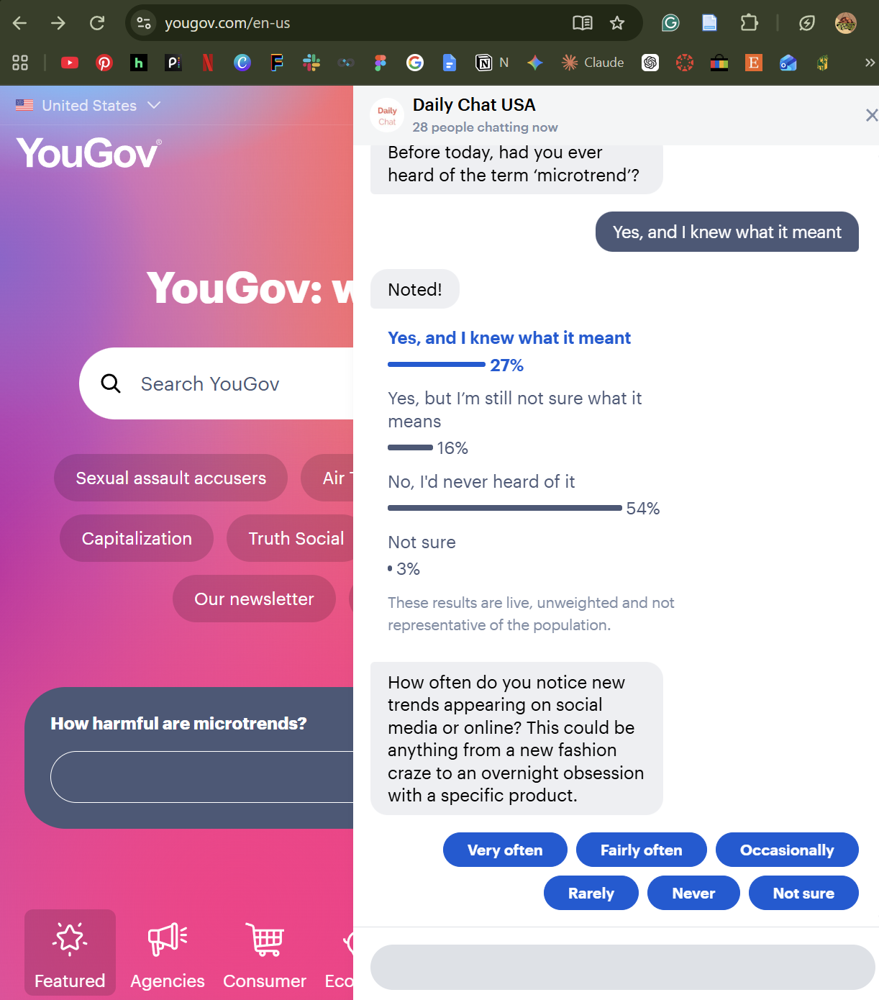
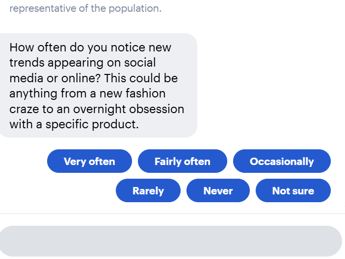
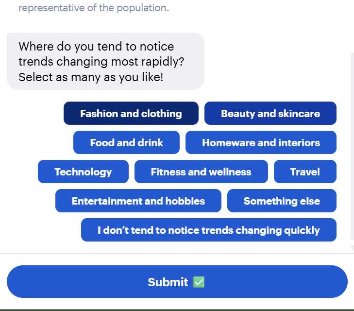
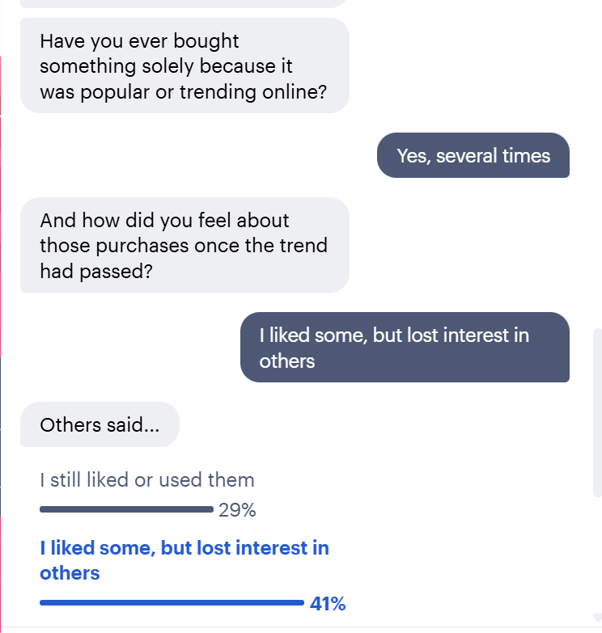

## Introduction

For this assignment, I signed up for the YouGov consumer panel and took part in one of their Daily Chat surveys. The topic was microtrends, which are short-lived trends that spread quickly online, usually around fashion, beauty, or specific products. The survey was set up like a chat conversation, with one question at a time and tappable answer buttons, and it showed live poll results after some of my answers.

At first the questions seemed simple and casual. Once I started looking at them from a survey design perspective, though, I noticed several choices that seemed strange or that could affect how people answered. Below are the questions that stood out to me, why I chose them, and what I learned that I can apply to my own research project.

## Question 1: Awareness of the Term "Microtrend"

{#fig-q1 width=80%}

The first question asked, "Before today, had you ever heard of the term 'microtrend'?" (@fig-q1). What stood out to me was that the YouGov page behind the chat already had a headline that said "How harmful are microtrends?" That means I saw the term before I was asked whether I knew it. The phrase "before today" seems to be their way of handling this, but it depends on people being able to separate what they already knew from what they just read.

I did think the answer options were well designed. Instead of a simple yes or no, they separated people who had heard the term and knew what it meant from people who had heard it but weren't sure. I answered that I had heard of it and knew what it meant. That split gives better information than just measuring awareness.

The other thing I noticed was that the results appeared right after I answered, showing that 54% of people had never heard of the term. Seeing how others answered could influence how someone responds to the rest of the survey, especially if they start comparing themselves to the group.

## Question 2: How Often People Notice Trends

{#fig-q2 width=80%}

The second question asked how often I notice new trends on social media or online (@fig-q2). The answer choices were "very often," "fairly often," "occasionally," "rarely," "never," and "not sure." I chose this question because these labels can mean very different things to different people. Since I work in ecommerce and spend a lot of time around product content, "very often" to me might mean every day, while someone else might use it to mean once a week. Because of that, two people could pick the same answer while having completely different experiences.

The question also gave examples, like "a new fashion craze" or "an overnight obsession with a specific product." The examples help explain what a trend is, but they also push people toward thinking about certain types of trends over others.

## Question 3: Where Trends Change Most Rapidly

{#fig-q3 width=80%}

This question asked, "Where do you tend to notice trends changing most rapidly? Select as many as you like!" (@fig-q3). This one confused me because the wording and the instructions don't match. "Most rapidly" suggests picking one category, but then it says to select as many as you want. If someone selects five categories, the results can't really show which one is changing the fastest.

I also noticed that one option was "I don't tend to notice trends changing quickly." Logically, that answer shouldn't be combined with the others, but it was in the same multi-select list, so it wasn't clear if someone could choose it along with other categories. Fashion and clothing was also listed first, which could make it more likely to be picked just because of its position.

## Questions 4 and 5: Buying Something Because It Was Trending

{#fig-q4 width=80%}

The fourth question asked, "Have you ever bought something solely because it was popular or trending online?" (@fig-q4). I chose this one because of the word "solely." Most purchases happen for more than one reason. Someone might buy a trending product partly because it was popular and partly because they actually needed it, and that person might answer no even though the trend clearly influenced them. I also think some people may not want to admit they bought something just because of hype, which could make the "yes" responses lower than they really are.

I answered "Yes, several times," which led to a follow-up question: "And how did you feel about those purchases once the trend had passed?" I liked that this question only appeared because of my previous answer, since that kept the survey relevant to me. However, the question assumes the trend has already passed, which might not be true for everyone. It also asks how I felt, but the answers focus on whether I still liked or used the items. The option "I still liked or used them" combines two different things, since someone could still like a product without actually using it. Finally, the question depends on people remembering past purchases accurately, which can be hard.

## Why I Chose These Questions

I chose these questions because each one shows a different way that survey design can affect the data, even when the questions look simple. Question 1 shows how exposure to a term can affect an awareness question. Question 2 shows how vague answer labels make responses harder to compare. Question 3 shows what happens when the wording and the instructions conflict. Questions 4 and 5 show how strong words and built-in assumptions can shape answers.

These questions also connect to my work in ecommerce. Trend-driven buying affects decisions like what products to stock, when to launch them, and how much inventory to order. If a brand used data from questions like these, small wording problems could lead to the wrong conclusions about how much trends actually drive sales.

## Lessons for My Research Project

This experience gave me several ideas I can use for our CEP survey research:

1. Ask awareness questions before exposing respondents to the topic. For example, if our survey asks whether people have heard of equine-assisted therapy, that question should come before any description of Wellness Ranch or its services.
2. Use specific frequency options instead of vague labels. Choices like "daily" or "a few times a month" are easier to compare than "often" or "occasionally."
3. Make sure the wording matches the question type. If a question allows multiple answers, it shouldn't ask for the "most" of something, and any "none of these" option should be set up so it can't be selected with other answers.
4. Avoid absolute words like "solely," "always," or "never" in questions, since they can push people toward one answer.
5. Use skip logic to keep the survey relevant, but avoid building assumptions into follow-up questions.
6. Be careful about who is taking the survey. YouGov noted that the live results were unweighted and not representative of the population, which reminded me that a self-selected sample can look very different from the group we actually want to learn about.
