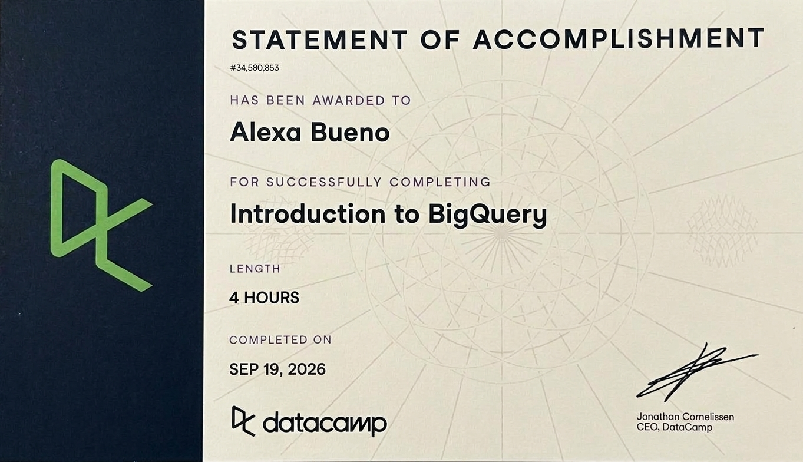
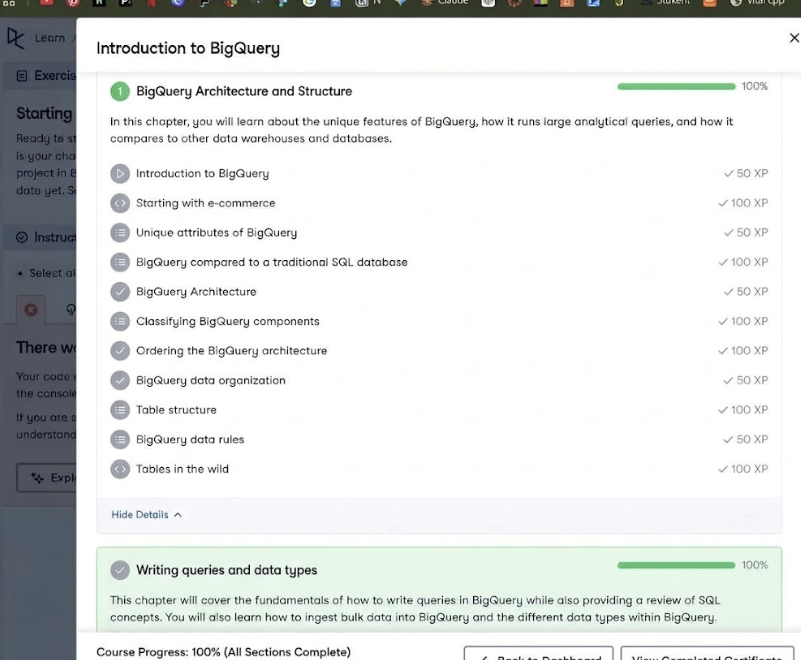
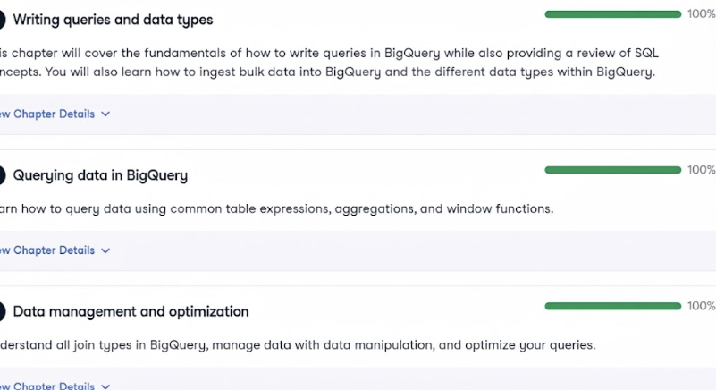

# Course-Completion Evidence

{fig-align="center" width="85%"}

{fig-align="center" width="85%"}

{fig-align="center" width="85%"} \# Learning Notes and Key Takeaways

## Chapter 1: BigQuery Basics

### How Data Is Organized

- **Project:** the top level, where billing and permissions live
- **Dataset:** a folder inside a project that groups related tables (for example, `ecommerce`)
- **Table:** the actual rows and columns (for example, `ecomm_order_details`)

Tables are referenced as `project.dataset.table`. GA4 exports follow this same structure: one project, an analytics dataset, and daily events tables.

### Regions

- Every dataset is stored in a specific location, like US or EU.
- You can query different datasets in the same region as long as you have access to both.
- A single query cannot combine data from different regions.
- Tables can be moved between regions by copying the dataset to the new location.
- Business takeaway: decide where data lives before building pipelines, or you won't be able to join sources stored in different regions.

## Chapter 2: Writing Queries and Data Types

### Query Basics

- Clauses always follow this order: SELECT, FROM, WHERE, GROUP BY, HAVING, ORDER BY, LIMIT.
- SELECT \* pulls every column. LIMIT controls how many rows display.
- AS renames a column in the results.
- WHERE filters rows, and ORDER BY sorts them.
- In DataCamp exercises, every blank has to be filled in or the code throws a syntax error.

### Common Data Types

| Type      | What it holds                | Ecommerce example      |
|-----------|------------------------------|------------------------|
| INT64     | Whole numbers                | Quantity ordered       |
| NUMERIC   | Exact decimals               | Prices, revenue        |
| FLOAT64   | Approximate decimals         | Averages, ratios       |
| STRING    | Text                         | Product category       |
| BOOL      | True or false                | Returning customer     |
| DATE      | Calendar date                | Order date             |
| TIMESTAMP | Exact moment with time zone  | Checkout time          |
| DATETIME  | Date and time, no time zone  | Store opening time     |
| ARRAY     | A list of values in one cell | All items in one order |
| STRUCT    | Grouped fields in one cell   | Shipping address parts |

- NUMERIC is better for money because FLOAT64 can introduce small rounding errors.
- CAST converts one type to another and errors if it fails. SAFE_CAST returns NULL instead of an error.

### Loading Data

- Bulk data can be loaded from files such as CSV, JSON, Avro, or Parquet, either from your computer or Google Cloud Storage.
- BigQuery can auto-detect the schema, but defining it yourself avoids mistakes like ZIP codes losing leading zeros.

## Chapter 3: Querying Data

### Common Table Expressions (CTEs)

- A CTE is a temporary, named result set created at the start of a query with WITH, then used like a table.
- They make long queries easier to read and debug.
- Multiple CTEs use one WITH and are separated by commas.
- They help with optimization by filtering data early so only needed rows move forward.

### Aggregations

| Function  | What it does                           |
|-----------|----------------------------------------|
| COUNT     | Number of rows                         |
| SUM       | Total                                  |
| AVG       | Average                                |
| MIN / MAX | Lowest and highest value               |
| COUNTIF   | Counts only rows that meet a condition |

- Any column in SELECT that isn't aggregated must appear in GROUP BY.
- COUNTIF is useful for quick segment counts, like how many products weigh over 5,000 grams.

### WHERE vs. HAVING

- WHERE filters individual rows before grouping and can't use aggregates.
- HAVING filters groups after aggregation and can use aggregates.
- Example: finding product categories with an average weight over 10,000 grams requires HAVING, since the average only exists after grouping. Those heavy categories would likely drive up shipping costs.

### ANY_VALUE

Returns any one value from each group. It's handy when a column is the same across the group and you don't want to add it to GROUP BY.

### Special Aggregations

| Function | What it does |
|----|----|
| LOGICAL_AND | True only if every row in the group meets the condition |
| LOGICAL_OR | True if at least one row meets it |
| STRING_AGG | Combines text from many rows into one string |
| ARRAY_AGG | Combines values into an array |
| ARRAY_CONCAT_AGG | Merges multiple arrays into one |
| APPROX_COUNT_DISTINCT | Fast estimate of unique values |
| APPROX_QUANTILES | Estimated percentiles or quartiles |
| APPROX_TOP_COUNT | Estimated most frequent values |

- STRING_AGG is useful for showing every category a customer bought in one readable line.
- Approximate functions are faster and cheaper on huge tables. They work well when a close estimate is good enough, like counting unique website visitors.

### Window Functions

- Window functions calculate across related rows without collapsing them the way GROUP BY does.
- OVER defines the window. PARTITION BY sets the group, and ORDER BY sets the order within it.
- Common ones: ROW_NUMBER, RANK, LAG (previous row), LEAD (next row), and running SUM.
- Business uses: identifying each customer's first order, running revenue totals, and comparing this month's sales to last month's.

## Chapter 4: Data Management and Optimization

### Join Types

| Join       | What it keeps                                            |
|------------|----------------------------------------------------------|
| INNER      | Only rows that match in both tables                      |
| LEFT       | All rows from the left table plus matches from the right |
| RIGHT      | All rows from the right table plus matches from the left |
| FULL OUTER | Everything from both tables                              |
| CROSS      | Every possible combination of rows                       |

- Example: a LEFT JOIN from products to orders reveals products that have never sold.
- Unmatched rows show NULL in the columns from the other table.

### UNNEST with CROSS JOIN

- UNNEST turns an array into separate rows, one per element.
- This comes up constantly with GA4 data, where event parameters are stored as arrays.

### Joins with Aggregations

- Joining first can duplicate rows, for example one order with five items becoming five rows, which inflates totals.
- Aggregating before joining avoids this and is usually more efficient.

### DML (Data Manipulation Language)

| Statement | What it does                                                    |
|-----------|-----------------------------------------------------------------|
| INSERT    | Adds new rows                                                   |
| UPDATE    | Changes existing rows                                           |
| DELETE    | Removes rows                                                    |
| MERGE     | Inserts, updates, or deletes in one step based on matching rows |

Considerations:

- UPDATE and DELETE require a WHERE clause in BigQuery.
- DML statements scan data, so they cost money like queries.
- BigQuery is built for analysis, not frequent small edits, so changes should be batched.
- It's smart to preview affected rows with a SELECT before running an UPDATE or DELETE.

### Query Optimization

- Select only the columns you need instead of SELECT \*.
- LIMIT does not reduce cost on regular tables. It limits rows displayed, not data scanned.
- Filter early, especially on date columns.
- Partitioned tables (split by date) and clustered tables (organized by a column) let BigQuery skip data.
- Aggregate before joining.
- Use approximate functions for very large tables.
- Check the estimated bytes processed before running a query.

### Filtering Recent Data (Last 90 Days)

- Use DATE_SUB with CURRENT_DATE for DATE columns.
- Use TIMESTAMP_SUB with CURRENT_TIMESTAMP for TIMESTAMP columns.
- Mixing DATE and TIMESTAMP types causes errors.

## Common Mistakes to Watch For

- Leaving blanks unfilled in exercises
- Missing commas between columns, or an extra comma before FROM
- Selecting a column that isn't aggregated or in GROUP BY
- Using an aggregate in WHERE instead of HAVING

#### CEP application

This course gave me a much clearer picture of how BigQuery fits into our CEP work with Wellness Ranch. Since GA4 can export raw event data to BigQuery, understanding how projects, datasets, and tables are organized will help me find and access the site data our team is collecting. Skills like filtering by date, grouping with aggregations, and using HAVING will let me summarize things like traffic sources, page views, or conversions over specific time periods, which ties directly into my SEO performance analysis. I also learned that GA4 stores event details as arrays, so UNNEST will be important for pulling out information like page titles or traffic parameters. The optimization lessons were useful too, since selecting only needed columns and filtering early keeps queries efficient and cost-effective. Overall, this gives me a foundation for turning raw website data into summaries the team can actually use to make recommendations for Wellness Ranch.

# Appendix: Publication Links

- [GitHub Repository](https://github.com/Buenoalexa11/IBM6500)
- [Published Introduction to BigQuery Report](https://buenoalexa11.github.io/IBM6500/SQL2%20Intro%20to%20BQ.html)
